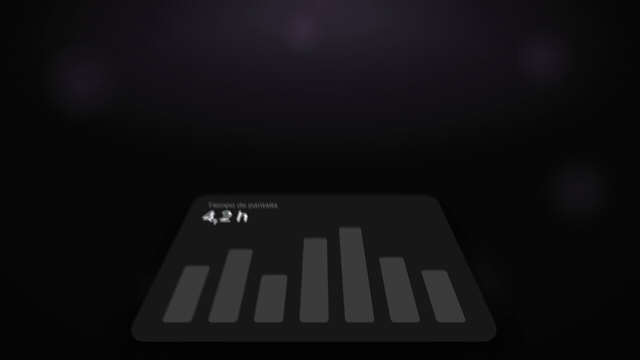
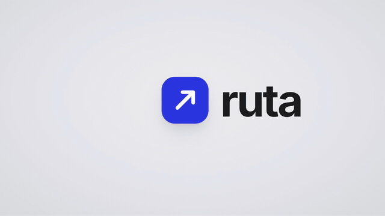
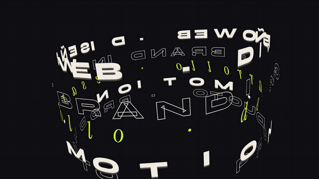
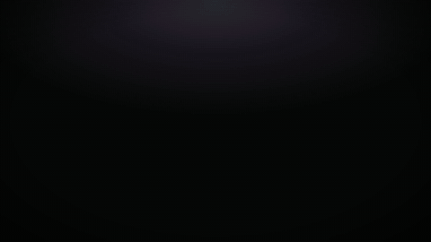
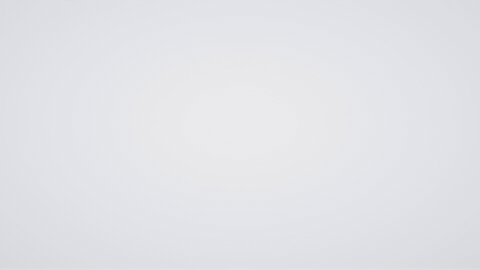
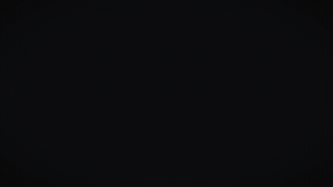
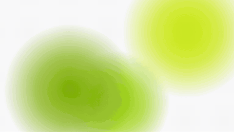
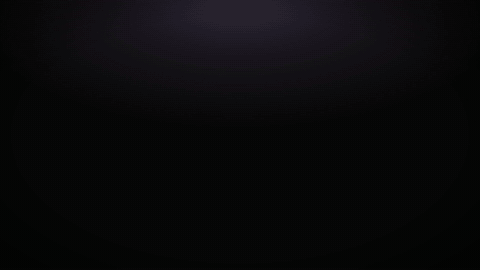
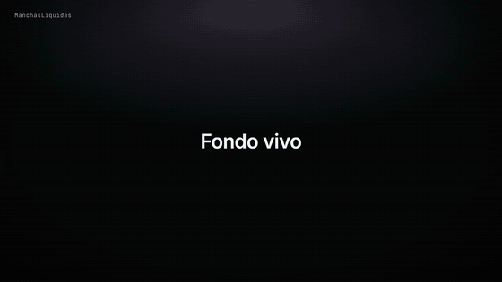

# Motion Graphics Skills for Claude Code

**Professional, fluid motion graphics in [Remotion](https://www.remotion.dev) — made by Claude.**
Ask *"make me a 30-second launch video in the dark style"* and get a 60 fps video that moves like a keynote: pieces
that fly in and rearrange, objects that morph into the next scene, kinetic typography, light, motion blur and
sound effects locked to every landing. No slideshows.

| Dark (keynote) | Light (SaaS intro) | Agency (reel) |
|---|---|---|
|  |  |  |

**One scene, any style — styles are mixable settings, not templates:**

| dark | light | agency | light-lime | dark + agency type & rhythm |
|---|---|---|---|---|
|  |  |  |  |  |

**Effects catalog** (`DemoEfectos2`, 24 s — liquid blobs, voice-synced phrase, chromatic flash, elastic pill tabs,
negative strobe, barrel-lens panel wall, light line, glowing card stack, orbits, word selection, tunnel, portal,
horizon logo reveal):



Full-quality MP4s are in [`docs/demos/`](docs/demos).

## What's inside
- **`motion-graphics`** (base skill): how to study the user's material (website, screenshots, logo) and copy it
  faithfully; **three ways to show an interface** — rebuild it as components (animated piece by piece), use the full
  screenshot in a browser/phone frame, or **cut parts** of the screenshot (a button, a card, a chart) as standalone
  pieces (with a script to crop, remove flat backgrounds and pad them); the rules measured on 9 professional
  references; the mixable style system; the workflow and how to measure the result.
- **`motion-oscuro`** · dark keynote style (+ variants `oscuro-halo`, `oscuro-brasa`, `oscuro-turquesa`).
- **`motion-claro`** · light SaaS-intro style (+ variant `claro-lima`).
- **`motion-agencia`** · agency reel style (one saturated color per bar, wide display type, HUD).
- **A Remotion kit** (`plugins/motion-graphics/skills/motion-graphics/kit`): the shared engine (`src/motion/base`),
  the styles (`src/motion/capas`), one demo per style, a style-mixing demo, an effects catalog, synthesized sound
  effects and music (no third-party rights), and scripts to render, take stills, crop pieces, generate music and
  measure rhythm.

### The engine in one paragraph
Everything runs at 60 fps on smooth PCHIP trajectories (no stop-and-go at keyframes, no overshoot unless asked),
controlled springs (overshoot is capped per style), real motion blur only on fast moves, a 2D/3D camera that never
stands still, `Forma` (an object that morphs: dot → pill → card → logo) to bridge scenes instead of cuts, light
transitions (flash, light leak, chromatic flash, negative strobe), liquid color blobs, kinetic typography (decode,
mask, punch, per-letter, neon, voice-synced phrases) and sound effects placed on the exact landing frame.

## Install
Requirements: [Claude Code](https://code.claude.com), Node.js 18+ (22 recommended), and ffmpeg for the helper
scripts (Remotion brings its own ffmpeg for rendering).

```bash
# 1. Add the marketplace (replace with the GitHub repo where this is published)
claude plugin marketplace add <owner>/<repo>

# 2. Install the plugin
claude plugin install motion-graphics@motion-graphics-skills

# 3. Check it loaded: the skills motion-graphics, motion-oscuro, motion-claro and motion-agencia should be listed
claude plugin details motion-graphics
```

Inside a session you can do the same with `/plugin marketplace add <owner>/<repo>` and `/plugin install
motion-graphics@motion-graphics-skills`.

### Try the kit
```bash
cp -r ~/.claude/plugins/…/motion-graphics/skills/motion-graphics/kit my-video   # or copy it from this repo
cd my-video
npm install
npm run dev               # Remotion Studio with all demos
npm run render:demos      # renders the three style demos to out/
node scripts/render.mjs render DemoMezcla ../path/to/props.json   # e.g. {"estilo":"claro","ajustes":{"acento":"#FF3B5C"}}
```

## Use it
Just ask Claude in a Remotion project, for example:
- *"Make a 25 s launch video for my app in the dark style. Here are screenshots of the dashboard and the logo."*
- *"Same video but light style, with my brand color #FF3B5C."*
- *"Agency style but with the calmer rhythm of the dark style."*
- *"Cut the pricing card and the CPU chart from this screenshot and animate them as separate pieces."*

Claude will study your material, choose one of the three ways to show the UI, write the event-by-event script
(one event per beat), build it with the kit, render stills to check framing, render the video, and measure it
(rhythm, stillness, frame jumps, loudness) before showing it to you.

## Repository layout
```
.claude-plugin/marketplace.json          # this marketplace
plugins/motion-graphics/
  .claude-plugin/plugin.json             # the plugin
  skills/
    motion-graphics/SKILL.md             # base skill
    motion-graphics/kit/                 # Remotion kit (engine, styles, demos, scripts, sounds)
    motion-oscuro/SKILL.md
    motion-claro/SKILL.md
    motion-agencia/SKILL.md
docs/demos/                              # demo videos and GIFs
LICENSE                                  # MIT
```
Only Remotion is supported today; the engine keeps Remotion-specific code in three small files (clock, motion blur,
sound) so other engines can be added later.

---

## En español
Skills para Claude Code que hacen motion graphics con ritmo profesional en Remotion: una base común (cámara, piezas
con trayectoria, objetos que se transforman, transiciones, tipografía cinética, sonido al fotograma, 60 fps sin
tirones) y estilos que son ajustes mezclables (oscuro, claro, agencia y sus variantes), más un kit de Remotion listo
para renderizar. Instalación: `claude plugin marketplace add <owner>/<repo>` y
`claude plugin install motion-graphics@motion-graphics-skills`. Las skills están escritas en español.

## License
MIT. The demo brands ("foco", "ruta", "norte", "pulso") are fictional. Sounds and music in the kit are synthesized by
the included scripts.
