# Motion Graphics Skills for Claude Code

**Professional, fluid motion graphics in [Remotion](https://www.remotion.dev) — made by Claude.**
Say *"MOTION GRAPHICS: a 30-second launch video for my app"* and get a 60 fps video that moves like a keynote: pieces
that fly in and rearrange, objects that morph into the next scene, kinetic typography, light, motion blur and
sound effects locked to every landing. No slideshows.

| Dark (keynote) | Light (SaaS intro) | Agency (reel) |
|---|---|---|
| 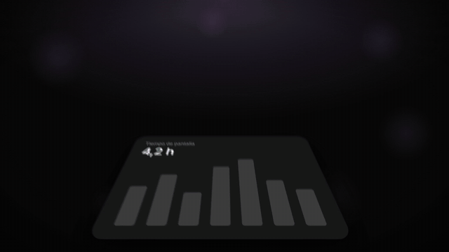 | 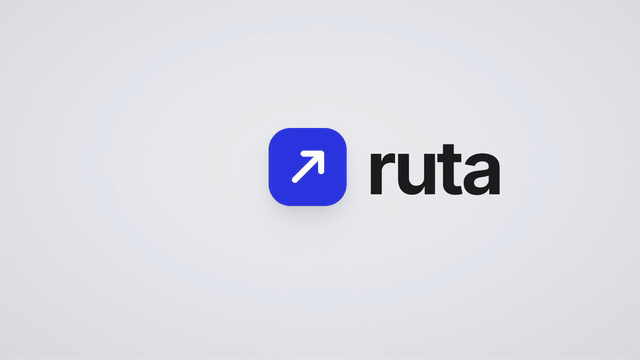 | 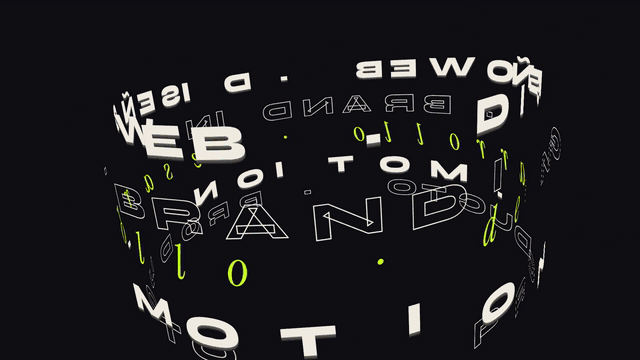 |

**One scene, any direction — directions are mixable settings, not templates:**

| dark | light | agency | light-lime | dark + agency type & rhythm |
|---|---|---|---|---|
| 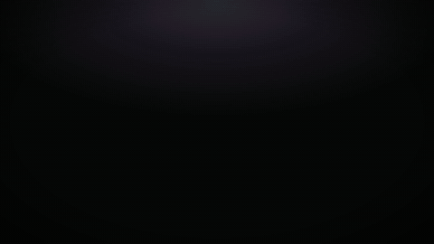 |  | 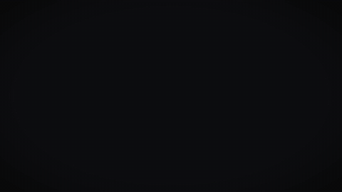 | 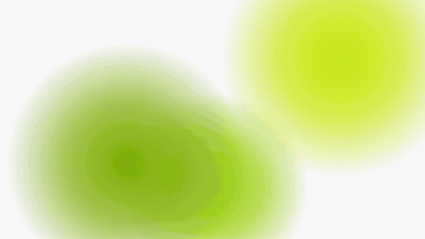 | 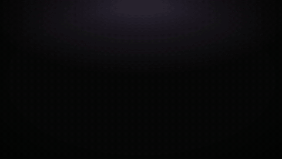 |

**Effects catalog** (`DemoEfectos2`, 24 s — liquid blobs, voice-synced phrase, chromatic flash, elastic pill tabs,
negative strobe, barrel-lens panel wall, light line, glowing card stack, orbits, word selection, tunnel, portal,
horizon logo reveal):

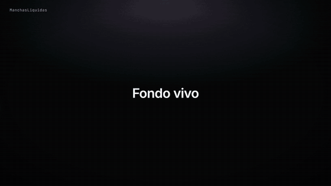

Full-quality MP4s are in [`docs/demos/`](docs/demos).

## Learned from references, frame by frame
Every style and variant comes from studying real motion graphics frame by frame (timing, easing measured per frame,
sampled palettes, type, layers, sound) and then **recreating them in this engine and checking the recreation against
the original** with `scripts/comparar-video.mjs` (image, color and timing per second). Round 4 added four variants,
each with its recreation as a composition in the kit:

| `oscuro-cobre` · warm dark, editorial serif, light that cools | `oscuro-cristal` · glass UI, typing with light, color per scene |
|---|---|
| 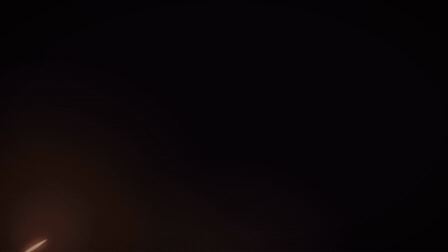 | 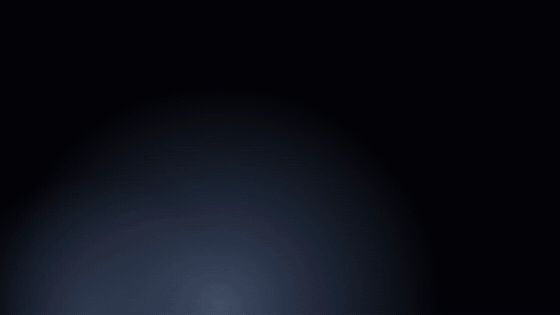 |
| **`agencia-punto`** · one red dot drives the whole reel, morphing particle cloud | **`taller`** · the video shows the tool it was made with, strict beat grid |
| 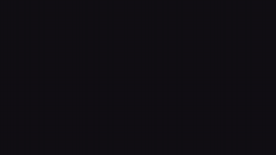 | 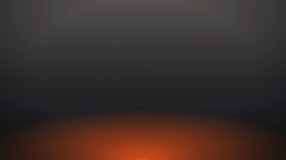 |

Verification against the originals (`comparar-video.mjs`, whole clip; timing = correlation of the motion curves, 1 = events
land on the same frames; color = mean chroma difference, < 8 = same palette):

| Variant | Timing | Color | Notes |
|---|---|---|---|
| `oscuro-cobre` | 0.87 | 1.5 | glass box slightly less saturated |
| `oscuro-cristal` | 0.95 | 2.9 | brand logos replaced by generic glyphs |
| `agencia-punto` | 0.92 | 5.6 | particle torus a bit streakier |
| `taller` | 0.81 | 5.4 | original was filmed from a monitor (washed-out colors) |

The original reference videos are not included (they belong to their authors); only our recreations are.

**Round 5 · light product motion.** Three light product videos (an app intro, a tracking flow, an integrations
page) were measured frame by frame and turned into reusable techniques: words that land one by one from blur and
scale, a sentence where only the ending changes, phones rising in a depth stack, a status timeline the camera travels,
a tilted ring of app icons around a sentence, a radial focus pull, a swirl into a light flood and a logotype that
types itself and re-centers. `RecSeguimiento` (12 s, 90 BPM, `claro-lavanda`, fictional brand "ruta") puts them together
in one piece. It is a **technique piece**, not a 1:1 recreation of one of the references, so it has no
`comparar-video.mjs` score; it was checked with stills, `medir-ritmo` (no frame jumps) and loudness (−14 LUFS).

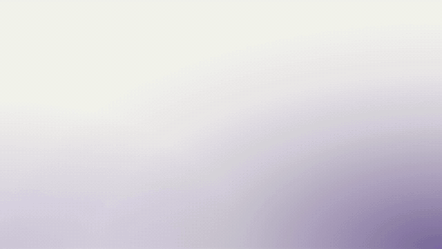

## Rebuilt UI = the real UI (mandatory fidelity process)
When the video rebuilds your product's interface as animatable components, it has to look **identical** to the real
one, not "something similar". The base skill makes Claude follow a mandatory process before drawing anything:
find the source of truth (your code, CSS variables, Tailwind config, real SVG logos, fonts, icon library, real
texts), copy colors, type, radii, shadows, spacing, icons and states as they are, rebuild each screen 1:1 with the
same structure, and then **compare rendered frames with real screenshots** side by side and pass a fidelity
checklist (logo, type, palette, icons, spacing, texts, states). The kit includes the tools:

```bash
node scripts/capturar.mjs https://your-app.example/dashboard refs/dashboard.png --ancho 1440 --alto 900   # reference screenshot
node scripts/extraer-tokens.mjs ../your-app --salida fidelidad/tokens.md   # colors, radii, shadows, fonts, icons… with file:line
node scripts/comparar-fidelidad.mjs refs/dashboard.png out/Video-3.5.png out/check.jpg --recorte 240,150,1440,900
```

Before / after on the fictional product in `kit/ejemplos/fidelidad` (`DemoFidelidad`): rebuilt "by eye" differs from
the real screenshot in 24 % of the pixels; following the process, 0 %.

| Rebuilt by eye (24 % of pixels differ) | Following the process (0 %) |
|---|---|
| 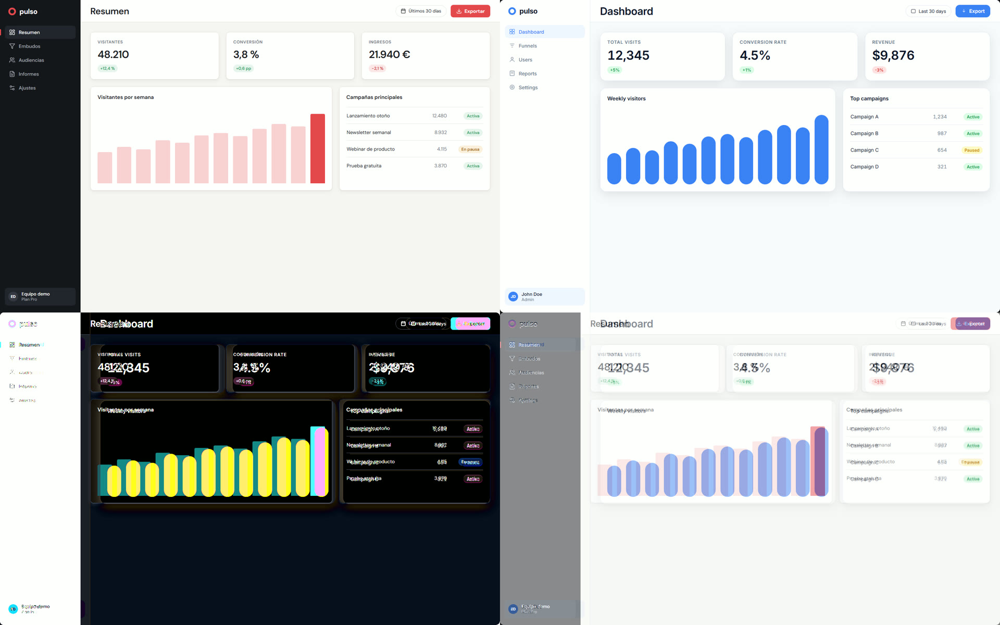 | 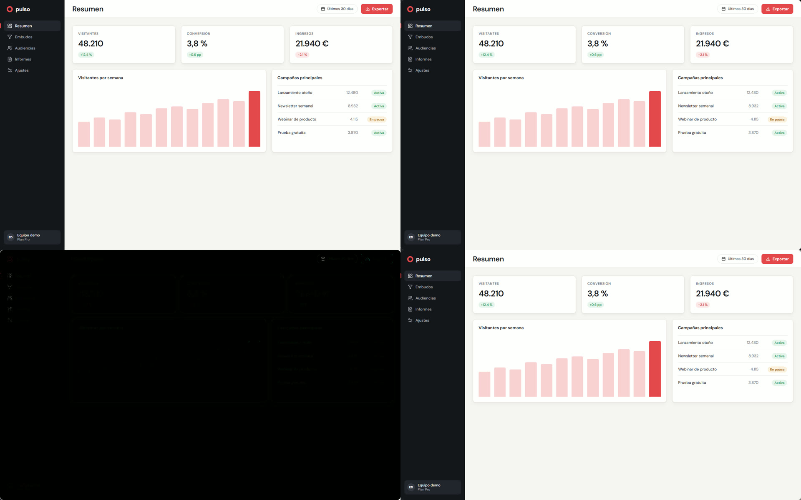 |

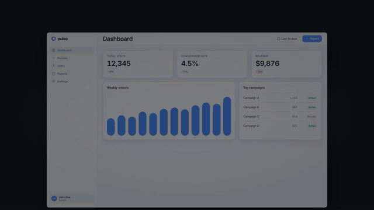

## What's inside: one master skill + combinable techniques (not styles)
Say **`MOTION GRAPHICS`** (or `/motion-graphics`) and describe what you want. The master skill works like a motion
director: it writes a short brief, decides the idea, the **thread** (the object that crosses the whole video and
changes role) and the hero moment, picks 1 strong technique + 2–4 supporting ones, writes the event-by-event script on
a beat grid, builds the piece with the kit and checks it before showing it to you.

| Skill | What it knows |
|---|---|
| **`motion-graphics`** (master) | brief → idea and thread → techniques → script → build → verify → deliver; starting *directions* (dark keynote, light SaaS, agency and their variants) as mixable settings, not templates |
| `motion-interfaz` | showing a product: rebuild its UI as components with a **mandatory fidelity process** (source of truth, copied tokens, comparison with real screenshots, checklist), animated cut-outs instead of full screenshots, phone screens, depth stacks of screens, status timelines the camera travels |
| `motion-movimiento` | asymmetric curves, PCHIP paths with no stop-and-go, capped springs, squash & stretch, 2D/3D camera that never stops, motion blur only where it's fast, framing |
| `motion-transiciones` | bridge objects that morph, the thread, cuts hidden by speed or light, zoom-through with match cut, light iris to the brand, focus pulls |
| `motion-tipografia` | kinetic type: blur-to-sharp, word by word, sentences where only one word changes, decode, mask, neon, logotypes that unfold from their initial; no boxes, no emojis |
| `motion-luz-fondo` | living backgrounds (corner light, halos, auroras, WebGL smoke shader), milky and frosted glass without `backdrop-filter` in 3D, depth of field, light that cools, grain |
| `motion-3d` | CSS 3D worlds with a travelling camera, parallax layers, icons floating around a sentence, orbits, tunnels, particle clouds that morph |
| `motion-ritmo-sonido` | strict beat grid, event-by-event script, synthesized music, sound effects locked to the landing frame, −14 LUFS |

- **A Remotion kit** (`plugins/motion-graphics/skills/motion-graphics/kit`): the shared engine (`src/motion/base`),
  the styles (`src/motion/capas`), one demo per style, a style-mixing demo, an effects catalog, synthesized sound
  effects and music (no third-party rights), and scripts to render, take stills, crop pieces, generate music,
  measure rhythm, capture reference screenshots, extract design tokens from code and compare renders with the real UI.

### The engine in one paragraph
Everything runs at 60 fps on smooth PCHIP trajectories (no stop-and-go at keyframes, no overshoot unless asked),
controlled springs (overshoot is capped per style), real motion blur only on fast moves, a 2D/3D camera that never
stands still, `Forma` (an object that morphs: dot → pill → card → logo) to bridge scenes instead of cuts, light
transitions (flash, light leak, chromatic flash, negative strobe), liquid color blobs, kinetic typography (decode,
mask, punch, per-letter, neon, voice-synced phrases) and sound effects placed on the exact landing frame.

## Install
Requirements: [Claude Code](https://code.claude.com), Node.js 18+ (22 recommended), and ffmpeg for the helper
scripts (Remotion brings its own ffmpeg for rendering).

```bash
# 1. Add the marketplace
claude plugin marketplace add FefeRP/motion-graphics-skills

# 2. Install the plugin
claude plugin install motion-graphics@motion-graphics-skills

# 3. Check it loaded: motion-graphics (master) and the seven motion-* technique skills should be listed
claude plugin details motion-graphics
```

Inside a session you can do the same with `/plugin marketplace add FefeRP/motion-graphics-skills` and `/plugin install
motion-graphics@motion-graphics-skills`.

### Try the kit
```bash
cp -r ~/.claude/plugins/…/motion-graphics/skills/motion-graphics/kit my-video   # or copy it from this repo
cd my-video
npm install
npm run dev               # Remotion Studio with all demos
npm run render:demos      # renders the three style demos to out/
node scripts/render.mjs render DemoMezcla ../path/to/props.json   # e.g. {"estilo":"claro","ajustes":{"acento":"#FF3B5C"}}
```

## Use it
Start with the keyword in a Remotion project (or an empty folder), for example:
- *"MOTION GRAPHICS: a 25 s launch video for my app. The code is in ../app, here is the logo."*
- *"MOTION GRAPHICS: a 10 s vertical hook for Instagram that shows how an order travels to the customer's door."*
- *"MOTION GRAPHICS: same video, light direction, with my brand color #FF3B5C and the energy of the agency rhythm."*
- *"Cut the pricing card and the CPU chart from this screenshot and animate them as separate pieces."* (technique skill on its own)

Claude will study your material, decide the idea and the thread, choose and mix techniques, write the event-by-event
script (one event per beat), build it with the kit, compare rebuilt screens with real screenshots, render stills to
check framing, render the video and measure it (rhythm, stillness, frame jumps, loudness) before showing it to you.

## Repository layout
```
.claude-plugin/marketplace.json          # this marketplace
plugins/motion-graphics/
  .claude-plugin/plugin.json             # the plugin
  skills/
    motion-graphics/SKILL.md             # master skill (keyword MOTION GRAPHICS)
    motion-graphics/references/          # directions, component catalog, how to learn a reference
    motion-graphics/kit/                 # Remotion kit (engine, directions, demos, recreations, scripts, sounds)
    motion-interfaz/  motion-movimiento/  motion-transiciones/  motion-tipografia/
    motion-luz-fondo/  motion-3d/  motion-ritmo-sonido/   # technique skills
docs/demos/                              # demo videos and GIFs
docs/fidelidad/                          # before/after fidelity comparison sheets
LICENSE                                  # MIT
```
Only Remotion is supported today; the engine keeps Remotion-specific code in three small files (clock, motion blur,
sound) so other engines can be added later.

---

## En español
Skills para Claude Code que hacen motion graphics con ritmo profesional en Remotion, organizadas por técnicas y no
por estilos: una skill maestra (palabra clave `MOTION GRAPHICS`) que entiende el pedido, decide la idea y el hilo
conductor, elige y mezcla técnicas y construye la pieza, y siete skills de técnica combinables (interfaz fiel,
movimiento, transiciones, tipografía, luz y fondos, 3D y partículas, ritmo y sonido), más un kit de Remotion listo
para renderizar. Las direcciones visuales (oscuro, claro, agencia y sus variantes) son ajustes mezclables. Cuando recrean la interfaz de tu producto, siguen un proceso obligatorio de fidelidad (fuente de
verdad, tokens copiados, comparación con capturas reales y lista de comprobación) para que sea idéntica a la real.
Instalación: `claude plugin marketplace add FefeRP/motion-graphics-skills` y
`claude plugin install motion-graphics@motion-graphics-skills`. Las skills están escritas en español.

## License
MIT. The demo brands ("foco", "ruta", "norte", "pulso") are fictional. Sounds and music in the kit are synthesized by
the included scripts.
